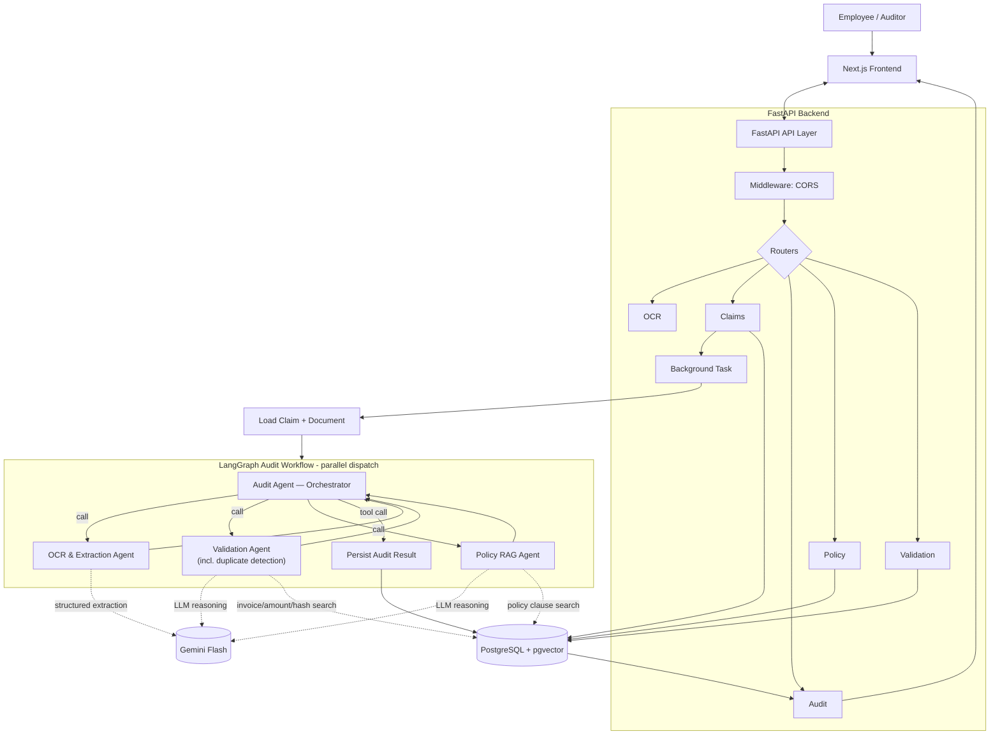

# Expense Audit Assistant — Architecture & Data Spec

AI-powered expense audit system: FastAPI + LangGraph agents + Gemini Flash (LLM) + PostgreSQL with pgvector for RAG.

The system helps company auditors/managers review employee expense claims. A multi-agent workflow validates the claim
against receipt data, business rules, and company policies, and produces a structured recommendation backed by relevant
references.

**Frontend:** Next.js (`apps/web`) · **Backend:** FastAPI (`apps/api`) · **Database:** PostgreSQL + pgvector ·
**ORM:** SQLAlchemy 2.x · **Driver:** psycopg 3 · **Migrations:** Alembic · **Agents:** LangGraph · **LLM:** Google Gemini Flash

## Architecture



The workflow runs the **OCR & Extraction Agent** first, then dispatches the **Validation Agent** and **Policy RAG
Agent** in parallel (each consumes only the extraction result, not each other's output). The orchestrator finally
aggregates both results into the persisted audit result — aggregation is deterministic application code
(`app/services/audit_service.py`), not another LLM call.

**Runtime flows**
- Master data (accounts, projects, employees) is seeded by Alembic migrations `3fc459b1feb6` and `3e645d1ba080`,
  mirrored in `data/seed/sql/seed_data.sql` (runnable via `psql "$DATABASE_URL" -f seed_data.sql`).
- Policy documents are ingested on demand: `POST /api/v1/policies/documents` → PDF text extraction → chunking →
  embedding (Gemini Embedding 2, 1536-dim) → pgvector chunks in one short transaction.
- Claim submission: `POST /api/v1/claims` (multipart `claim_json` + `receipt`) → background LangGraph audit →
  Gemini Flash OCR → parallel validation/policy agents → audit result persisted to `agent_response`.

## Backend Components

| Component | Purpose |
|---|---|
| Claims Router | Create/submit claims (multipart `claim_json` + `receipt`); schedule background audit |
| OCR Router | `POST /api/v1/ocr/extract` — receipt → structured extraction |
| Audit Router | `POST /api/v1/audits/{claim_id}/run` — start the LangGraph workflow |
| Policy Router | `POST /api/v1/policies/documents` (ingest) and `POST /api/v1/policies/search` (retrieval) |
| Validation Router | `POST /api/v1/validation/evaluate` — run the Validation Agent standalone |
| Health Router | `GET /health` — exists (`app/api/health.py`) but **not yet registered** in `main.py` |
| Middleware | CORS only (logging is configured via `app/core/logging.py`; no error-handling middleware) |
| Claim / File / Audit / Policy Service | Business logic behind each router |
| Validation Rules | Deterministic rules in `app/rules/` (amounts, dates, cross-field, budget, duplicates, authenticity heuristics) — invoked by the **Validation Agent** |
| Gemini Client | Calls Gemini Flash with retry, timeout, structured-output validation |
| RAG Service | Policy vector retrieval for the **Policy RAG Agent** |

*Authentication is not built yet: `app/api/auth.py`, `app/api/dashboard.py`, and `app/api/uploads.py` are empty
placeholder routers. The `employees` table carries seeded `username`/`password` values (dummy, plain text), but no
auth endpoints exist.*

## LangGraph Agents

LangGraph runs only inside the audit background task (not a separate server). There is **one orchestrating agent and
three sub-agents**. The Audit Agent lives between stages: each sub-agent is invoked, returns a structured result,
and control returns to the orchestrator before the next stage.

| Agent | Role | Input | Output |
|---|---|---|---|
| **Audit Agent** (orchestrator) | Orchestrates the workflow: invokes the 3 sub-agents, manages state/handoffs, aggregates results, persists state, and synthesizes the final result | Claim + document | Structured audit result: risk assessment, findings, recommendation, references |
| OCR & Extraction Agent | Sub-agent, called by the orchestrator. Normalizes the input into structured data | Uploaded invoice/form | Structured expense data (merchant, invoice #, date, amount, currency, category) |
| Validation Agent | Sub-agent, called by the orchestrator. Runs deterministic rules (amounts, dates, cross-field, budget, duplicates, authenticity heuristics) plus LLM-based authenticity reasoning. Duplicate detection scores claims by merchant, amount, document number, and a 7-day date window — it does not use file/image hashes | Claim + extracted expense data | Structured validation result + duplicate candidates |
| Policy RAG Agent | Sub-agent, called by the orchestrator. Retrieves and reasons over company policy context | Category + claim context | Relevant policy findings + citations, retrieved via pgvector |

**LLM usage:** Gemini Flash is used for OCR & Extraction (reading receipts), Validation authenticity reasoning, and
Policy RAG reasoning. The Audit Agent's final aggregation is **deterministic** application code — it does not call an
LLM. Deterministic checks (totals, date math, required fields, budget, duplicates) stay as plain Python rules, not
Gemini calls.

## Layered Boundaries

```text
API
  ↓
Application / Workflow
  ↓
Agents
  ↓
Tools / Services
  ↓
Infrastructure
  ↓
PostgreSQL / External Services
```

Business logic must not be placed directly inside FastAPI route handlers. Agents must not construct SQL or hold
database sessions; they use narrow, well-defined tools that delegate to application services.

## Project Structure

```
apps/api/
├── requirements.txt
└── app/
    ├── main.py
    ├── api/                       # Routers (HTTP) - audits, claims, policies, validation, health
    │                              #   (auth/dashboard/uploads are empty stubs)
    ├── routers/                   # ocr_extraction.py - OCR/extraction router (mounted by main.py)
    ├── core/                      # config, security libs, logging, dependencies
    ├── db/                        # session, base, migrations/
    ├── models/                    # SQLAlchemy ORM models
    ├── schemas/                   # Pydantic contracts (API, agent, tool, persistence)
    ├── repositories/              # data access layer
    ├── services/                  # application/business logic, gemini client, rag, file service
    ├── agents/                    # LangGraph - state.py, audit_agent.py, ocr_agent.py,
    │                              #   validation_agent.py, policy_rag_agent.py, mappers/
    ├── tools/                     # agent tool layer (get_claim, fetch_receipt, store_*, ...)
    ├── rules/                     # deterministic validation rules
    ├── prompts/                   # LLM prompt templates
    └── utils/                     # file_hash (other utils are empty stubs)
```

The final human-facing outcome is **decision support for the auditor/manager** — recommendation, reasons, validation
findings, policy findings, grounding references, warnings, and confidence — not autonomous approval or rejection
unless that behavior is explicitly introduced later.

## Technology Stack

- **FastAPI** for HTTP APIs: typed request/response models, dependency injection, async endpoints.
- **Pydantic** for structured contracts between API, agents, tools, and services.
- **SQLAlchemy 2.x** (modern `Mapped` / `mapped_column` style) with **psycopg 3** as the driver.
- **PostgreSQL** with JSON/JSONB only for genuinely semi-structured data.
- **Alembic** for all schema migrations.
- **pgvector** for policy document vector storage and similarity retrieval.

Detailed standards: `backend/technology-stack.md`, `backend/rag-pipeline.md`.