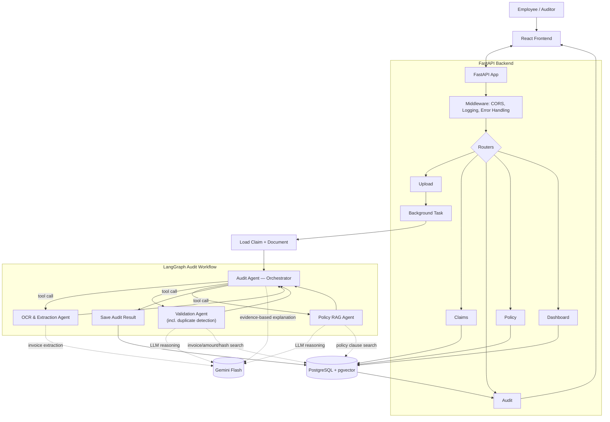

# Expense Audit Assistant — Architecture & Data Spec

AI-powered expense audit system: FastAPI + LangGraph agents + Gemini Flash (LLM + OCR) + PostgreSQL with pgvector for RAG.

## Architecture



**Runtime flows**
- `data/input/` → `seed_postgres.py` → PostgreSQL (employees, historical claims)
- `data/input/policies/` → `index_policies.py` → pgvector embeddings table in PostgreSQL
- Frontend upload → `storage/uploads/` → Gemini Flash OCR → PostgreSQL (audit results)

## Backend Components

| Component | Purpose |
|---|---|
| Upload Router | Upload invoice/receipt/form; store path + hash |
| Claims Router | Create/submit claims, add expense lines |
| Audit Router | Start audit, get status/findings/decision |
| Policy Router | Upload policy docs, trigger pgvector indexing |
| Dashboard Router | Claims/violations/duplicates/risk counts |
| Middleware | CORS, logging, error handling |
| Claim / File / Audit / Policy Service | Business logic behind each router |
| Duplicate Service | Searches PostgreSQL for likely duplicate claims — invoked by the **Validation Agent** |
| Gemini Client | Calls Gemini Flash with retry, timeout, rate-limit, JSON validation |

*Auth is intentionally left out of the current architecture — it will be added in a later phase.*

## LangGraph Agents

LangGraph runs only inside the audit background task (not a separate server). There is **one orchestrating agent and three sub-agents** — no standalone duplicate-detection agent; duplicate checking is handled inside the Validation Agent.

| Agent | Role | Input | Output |
|---|---|---|---|
| **Audit Agent** (orchestrator) | Orchestrates the workflow: invokes the 3 sub-agents as tools, manages state/handoffs, and synthesizes the final result | Claim + document | Risk score, violation findings, recommendation |
| OCR & Extraction Agent | Sub-agent, called by the orchestrator | Uploaded invoice/form | Structured invoice JSON (merchant, invoice #, date, amount, currency, category) |
| Validation Agent | Sub-agent, called by the orchestrator. Checks total/tax/date/missing-receipt/claimed-amount mismatch **and** performs duplicate detection (exact + fuzzy match on invoice #, merchant, amount, file/image hashes) | Claim + extracted invoice JSON | Validation findings + duplicate score/candidates |
| Policy RAG Agent | Sub-agent, called by the orchestrator | Category + claim context | Relevant policy rule + citation, retrieved via pgvector similarity search |

**LLM usage:** Gemini Flash is the single model used across the whole workflow — OCR & Extraction (reading invoices/forms), Validation and Policy RAG reasoning, and the orchestrator's final evidence-based audit explanation. Simple deterministic checks (totals, date math) stay as plain Python, not Gemini calls.

## Project Structure

```
expense-audit-assistant/
│
├── backend/
│ │
│ ├── app/
│ │ ├── main.py
│ │ │
│ │ ├── api/
│ │ │ ├── auth.py
│ │ │ ├── uploads.py
│ │ │ ├── claims.py
│ │ │ ├── audits.py
│ │ │ ├── policies.py
│ │ │ ├── dashboard.py
│ │ │ └── health.py
│ │ │
│ │ ├── core/
│ │ │ ├── config.py
│ │ │ ├── security.py
│ │ │ ├── logging.py
│ │ │ ├── exceptions.py
│ │ │ └── dependencies.py
│ │ │
│ │ ├── db/
│ │ │ ├── session.py
│ │ │ ├── base.py
│ │ │ └── migrations/
│ │ │
│ │ ├── models/
│ │ │ ├── user.py
│ │ │ ├── employee.py
│ │ │ ├── claim.py
│ │ │ ├── expense_line.py
│ │ │ ├── document.py
│ │ │ ├── audit_run.py
│ │ │ ├── audit_finding.py
│ │ │ ├── review_decision.py
│ │ │ └── policy.py
│ │ │
│ │ ├── schemas/
│ │ │ ├── auth.py
│ │ │ ├── employee.py
│ │ │ ├── claim.py
│ │ │ ├── document.py
│ │ │ ├── extraction.py
│ │ │ ├── audit.py
│ │ │ ├── policy.py
│ │ │ └── common.py
│ │ │
│ │ ├── repositories/
│ │ │ ├── employee_repository.py
│ │ │ ├── claim_repository.py
│ │ │ ├── document_repository.py
│ │ │ ├── audit_repository.py
│ │ │ └── policy_repository.py
│ │ │
│ │ ├── services/
│ │ │ ├── auth_service.py
│ │ │ ├── claim_service.py
│ │ │ ├── file_service.py
│ │ │ ├── audit_service.py
│ │ │ ├── policy_service.py
│ │ │ ├── rag_service.py
│ │ │ ├── duplicate_service.py
│ │ │ ├── gemini_client.py
│ │ │ └── dashboard_service.py
│ │ │
│ │ ├── agents/
│ │ │ ├── graph.py
│ │ │ ├── state.py
│ │ │ ├── audit_agent.py
│ │ │ ├── ocr_agent.py
│ │ │ ├── validation_agent.py
│ │ │ └── policy_rag_agent.py
│ │ │
│ │ ├── rules/
│ │ │ ├── amount_rules.py
│ │ │ ├── date_rules.py
│ │ │ ├── receipt_rules.py
│ │ │ ├── category_rules.py
│ │ │ └── policy_rules_loader.py
│ │ │
│ │ ├── prompts/
│ │ │ ├── ocr_extraction_prompt.txt
│ │ │ └── audit_assessment_prompt.txt
│ │ │
│ │ └── utils/
│ │ ├── file_hash.py
│ │ ├── image_hash.py
│ │ ├── date_utils.py
│ │ └── money_utils.py
│ │
│ ├── tests/
│ │ ├── unit/
│ │ │ ├── test_validation_agent.py
│ │ │ ├── test_audit_agent.py
│ │ │ └── test_rules.py
│ │ ├── integration/
│ │ │ ├── test_claim_api.py
│ │ │ └── test_audit_workflow.py
│ │ └── evaluation/
│ │ └── test_expected_audit_results.py
│ │
│ ├── requirements.txt
│ ├── Dockerfile
│ └── .env.example
│
├── frontend/
│ ├── src/
│ │ ├── pages/
│ │ │ ├── LoginPage.tsx
│ │ │ ├── SubmitClaimPage.tsx
│ │ │ ├── ClaimDetailsPage.tsx
│ │ │ ├── AuditQueuePage.tsx
│ │ │ ├── PolicyManagementPage.tsx
│ │ │ └── DashboardPage.tsx
│ │ │
│ │ ├── components/
│ │ │ ├── ClaimForm.tsx
│ │ │ ├── FileUpload.tsx
│ │ │ ├── AuditFindingCard.tsx
│ │ │ ├── DuplicateComparison.tsx
│ │ │ ├── PolicyCitation.tsx
│ │ │ └── DashboardCharts.tsx
│ │ │
│ │ ├── services/
│ │ │ ├── apiClient.ts
│ │ │ ├── authService.ts
│ │ │ ├── claimService.ts
│ │ │ └── auditService.ts
│ │ │
│ │ ├── hooks/
│ │ │ ├── useAuth.ts
│ │ │ └── useAuditStatus.ts
│ │ │
│ │ ├── types/
│ │ │ ├── claim.ts
│ │ │ └── audit.ts
│ │ │
│ │ ├── App.tsx
│ │ └── main.tsx
│ │
│ ├── package.json
│ └── Dockerfile
│
├── data/
│ ├── input/
│ │ ├── master/
│ │ │ └── employees.csv
│ │ │
│ │ ├── policies/
│ │ │ ├── expense_policy_v1.pdf
│ │ │ └── policy_rules_v1.json
│ │ │
│ │ ├── claims/
│ │ │ ├── CLM-0001.json
│ │ │ ├── CLM-0002.json
│ │ │ └── CLM-0003.json
│ │ │
│ │ ├── reimbursement_forms/
│ │ │ ├── CLM-0001_form.pdf
│ │ │ ├── CLM-0002_form.pdf
│ │ │ └── CLM-0003_form.pdf
│ │ │
│ │ ├── invoices/
│ │ │ ├── INV-0001.pdf
│ │ │ ├── INV-0002.jpg
│ │ │ └── INV-0003.pdf
│ │ │
│ │ └── manifests/
│ │ └── claims_manifest.csv
│ │
│ ├── ground_truth/
│ │ ├── invoice_truth.json
│ │ └── expected_audit_results.csv
│ │
│ └── generated/
│ └── .gitkeep
│
├── storage/
│ ├── uploads/
│ │ └── .gitkeep
│ │
│ └── policies/
│ └── .gitkeep
│
├── scripts/
│ ├── generate_synthetic_data.py
│ ├── seed_postgres.py
│ ├── index_policies.py
│ └── evaluate_audit_results.py
│
├── docs/
│ ├── architecture.md
│ ├── api_contract.md
│ └── data_dictionary.md
│
├── docker-compose.yml
├── .gitignore
├── .env.example
└── README.md
```
