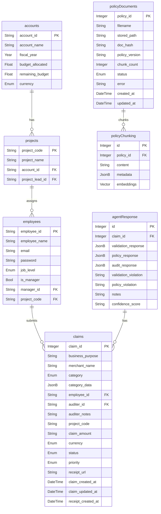

# Database Schema

**Single source of truth for persistence.** This file defines the authoritative database schema. The SQLAlchemy
models in `apps/api/app/models/` and the Alembic migrations must reflect exactly what is specified here. When this
schema changes, update the models **and** create a migration (see `docs/development/change-process.md`).

## Canonical Schema

### note on `policy_id`

`policy_chunking.policy_id` references `policy_documents.policy_id` (a policy source document), added via Alembic
migration `26228978c7ca`.

## Type Mapping

The domain types above map to PostgreSQL types as follows:

| Schema type | PostgreSQL / SQLAlchemy | Rationale |
|---|---|---|
| `String PK` / `String` | `VARCHAR` | Natural business keys (`account_id`, `project_code`, `employee_id`) are used directly as primary keys. |
| `Year` | `INTEGER` (e.g. `2026`) | A year is an integer. |
| `Float` (money) | `NUMERIC(14,2)` | Monetary values must be exact; floats introduce rounding errors. `budget_allocated`, `remaining_budget`, `claim_amount`. |
| `String confidence_score` | `NUMERIC(5,2)` | Numeric score for the agent's confidence (e.g. `92.00`). |
| `Enum` | Native PostgreSQL `ENUM` | Enums are stored as real PG enum types (`native_enum=True`) so the database enforces the allowed values. Enum labels are the Python member names (e.g. `MEALS`, `DRAFT`). |
| `JsonB` | `JSONB` | `category_data`, `agent_response.validation_response` / `policy_response` / `audit_response`, `policy_chunking.metadata`. |
| `Vector[1536]` | `vector(1536)` (pgvector) | `policy_chunking.embeddings`, from the Gemini Embedding 2 model (`gemini-embedding-2`, `output_dimensionality=1536`). |
| `Bool` | `BOOLEAN` | `is_manager`. |
| `DateTime` | `TIMESTAMPTZ` | Timezone-aware timestamps (`DateTime(timezone=True)`). |
| `Integer PK` | `INTEGER` + `IDENTITY` | `claims.claim_id` and `agentResponse.id` are auto-incrementing sequences. |

## Relationship Rules

- `accounts.account_id ← projects.account_id`: one account has many projects. Deleting an account cascades to its projects.
- `employees.employee_id ← projects.project_lead_id`: a project has one lead (nullable; `SET NULL` on delete).
- `employees.employee_id ← employees.manager_id`: self-referential org chart (nullable; `SET NULL`). `manager_id`
  points to the employee who is the manager.
- `projects.project_code ← employees.project_code`: one project is assigned many employees (nullable; `SET NULL`).
- `employees.employee_id ← claims.employee_id`: `ON DELETE CASCADE`.
- `employees.employee_id ← claims.auditer_id`: the auditor assigned to the claim (nullable; `SET NULL`).
- `claims.claim_id ← agent_response.claim_id`: one claim has many agent responses. `ON DELETE CASCADE`.
- `policy_chunking.policy_id` references `policy_documents.policy_id`, `ON DELETE CASCADE` (a policy source has many chunks).
- `claims.project_code` is a plain indexed column from the source schema (no foreign key).

## Table Details

### `accounts`

| Column | Type | Constraints |
|---|---|---|
| `account_id` | VARCHAR(64) | PK |
| `account_name` | VARCHAR(255) | NOT NULL |
| `fiscal_year` | INTEGER | NOT NULL, indexed |
| `budget_allocated` | NUMERIC(14,2) | NOT NULL, default `0` |
| `remaining_budget` | NUMERIC(14,2) | NOT NULL, default `0` |
| `currency` | ENUM | NOT NULL, default `INR` |

### `projects`

| Column | Type | Constraints |
|---|---|---|
| `project_code` | VARCHAR(64) | PK |
| `project_name` | VARCHAR(255) | NOT NULL |
| `account_id` | VARCHAR(64) | NOT NULL, FK → `accounts.account_id` (CASCADE), indexed |
| `project_lead_id` | VARCHAR(64) | NULL, FK → `employees.employee_id` (SET NULL), indexed |

### `employees`

| Column | Type | Constraints |
|---|---|---|
| `employee_id` | VARCHAR(64) | PK |
| `employee_name` | VARCHAR(255) | NOT NULL |
| `email` | VARCHAR(255) | NOT NULL, unique — the login identifier |
| `password` | VARCHAR(255) | NOT NULL — **demo only, stored unhashed** (see below) |
| `job_level` | ENUM | NOT NULL |
| `is_manager` | BOOLEAN | NOT NULL, default `false` |
| `manager_id` | VARCHAR(64) | NULL, self-FK → `employees.employee_id` (SET NULL), indexed |
| `project_code` | VARCHAR(64) | NULL, FK → `projects.project_code` (SET NULL), indexed |

`employees.password` holds the login credential in plaintext so the sample
application can seed accounts for every existing employee. This is a deliberate
demo shortcut and contradicts `docs/backend/security.md`; a real deployment must
replace it with a salted hash column before storing any genuine credential.
Migration `c4e07b15a982` backfills `email` as `first.last@expenseaudit.test`
derived from `employee_name` (employee id appended on collision).

### `claims`

| Column | Type | Constraints |
|---|---|---|
| `claim_id` | INTEGER + IDENTITY | PK |
| `business_purpose` | TEXT | NULL |
| `merchant_name` | VARCHAR(255) | NULL |
| `category` | ENUM (`expense_category`) | NOT NULL, indexed |
| `category_data` | JSONB | NOT NULL, default `{}`; structure varies by `category` (see [Expense Category Data](#expense-category-data)) |
| `employee_id` | VARCHAR(64) | NOT NULL, FK → `employees.employee_id` (CASCADE), indexed |
| `auditer_id` | VARCHAR(64) | NULL, FK → `employees.employee_id` (SET NULL), indexed |
| `auditer_notes` | TEXT | NULL |
| `project_code` | VARCHAR(64) | NULL, indexed (no FK) |
| `claim_amount` | NUMERIC(14,2) | NOT NULL, default `0` |
| `currency` | ENUM | NOT NULL, default `INR` |
| `status` | ENUM | NOT NULL, default `draft`, indexed |
| `priority` | ENUM | NOT NULL, default `medium` |
| `receipt_url` | VARCHAR(1024) | NULL |
| `claim_created_at` | TIMESTAMPTZ | NULL, indexed |
| `claim_updated_at` | TIMESTAMPTZ | NULL |
| `receipt_created_at` | TIMESTAMPTZ | NULL |

### `agent_response`

| Column | Type | Constraints |
|---|---|---|
| `id` | INTEGER + IDENTITY | PK |
| `claim_id` | INTEGER | NOT NULL, FK → `claims.claim_id` (CASCADE), indexed |
| `validation_response` | JSONB | NULL, structured Validation Agent output |
| `policy_response` | JSONB | NULL, structured Policy RAG Agent output |
| `audit_response` | JSONB | NULL, structured Audit Agent aggregate (`AuditResult`) |
| `validation_violation` | TEXT | NULL, grounded summary of blocking/warning validation findings for the approver UI |
| `policy_violation` | TEXT | NULL, grounded summary of policy violations for the approver UI |
| `notes` | TEXT | NULL, Gemini approver-facing summary of this audit run |
| `confidence_score` | NUMERIC(5,2) | NULL, overall audit confidence (0–1 scale, e.g. `0.92`) |

### `policy_documents`

A single ingested policy PDF and its ingestion state.

| Column | Type | Constraints |
|---|---|---|
| `policy_id` | INTEGER + IDENTITY | PK |
| `filename` | VARCHAR(512) | NOT NULL |
| `stored_path` | VARCHAR(1024) | NOT NULL |
| `doc_hash` | VARCHAR(64) | NOT NULL, unique, indexed (sha256 content hash for dedupe) |
| `policy_version` | VARCHAR(64) | NULL |
| `chunk_count` | INTEGER | NOT NULL, default `0` |
| `status` | VARCHAR(32) | NOT NULL, default `completed` (`pending` / `completed` / `failed`) |
| `error` | VARCHAR(1024) | NULL |
| `created_at` | TIMESTAMPTZ | NOT NULL, default `now()` |
| `updated_at` | TIMESTAMPTZ | NOT NULL, default `now()`, on-update refreshed |

### `policy_chunking`

Chunked policy documents with embeddings for semantic search.

| Column | Type | Constraints |
|---|---|---|
| `id` | INTEGER + IDENTITY | PK |
| `policy_id` | INTEGER | NOT NULL, FK → `policy_documents.policy_id` (CASCADE), indexed |
| `content` | TEXT | NOT NULL |
| `metadata` | JSONB | NULL |
| `embeddings` | `vector(1536)` | NULL, Gemini Embedding 2 (`gemini-embedding-2`) |

Indexes:

- `ix_policy_chunking_policy_id`: btree on `policy_id`.
- `ix_policy_chunking_embeddings`: HNSW on `embeddings` with `vector_cosine_ops`
  (cosine distance; Gemini embeddings are normalized).

## Enumerations

Enums are stored as native PostgreSQL `ENUM` types. Labels are the Python member names.

- **currency**: `INR`, `USD`, `EUR`, `GBP`, `AUD`, `CAD`, `JPY` — shared by `accounts.currency` and `claims.currency`
- **job_level**: `L1`, `L2`, `L3`, `L4`, `L5`, `L6`
- **expense_category** (claims.category): `FOOD_MEALS`, `TRAVEL`, `ACCOMMODATION`, `OTHER`
- **claim_status** (claims.status): `DRAFT`, `SUBMITTED`, `IN_AUDIT`, `APPROVED`, `REJECTED`, `NEEDS_REVISION`
- **claim_priority** (claims.priority): `LOW`, `MEDIUM`, `HIGH`, `URGENT`

## Expense Category Data

The `claims.category_data` JSONB payload is structured per category. The API
contracts in `apps/api/app/schemas/expense.py` validate it against exactly one
of these shapes (discriminated union on `category` in `apps/api/app/schemas/claim.py`).

| Category | `category_data` fields | Types |
|---|---|---|
| `FOOD_MEALS` | `meal_type`, `merchant_name`, `number_of_people` | string, string, integer |
| `TRAVEL` | `travel_type`, `origin`, `destination`, `travel_date`, `travel_class`, `ticket_number` | string, string, string, date, string \| null, string \| null |
| `ACCOMMODATION` | `hotel_name`, `location`, `check_in`, `check_out`, `number_of_nights`, `no_of_rooms`, `room_type` | string, string, date, date, integer, integer, string \| null |
| `OTHER` | `expense_type`, `merchant_name`, `additional_details` | string, string \| null, JSONB \| null |